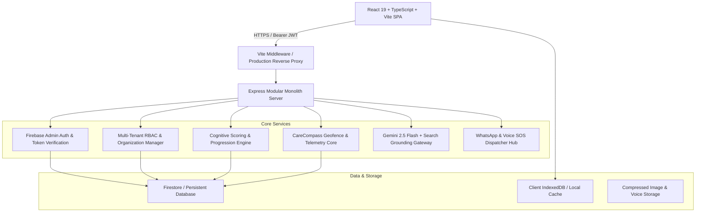

# SmritiSaathi – Layer 2: System Architecture

## 1. Component Diagram (Modular Monolith)



## 2. Stack Choices & Alternatives Evaluated

| Layer | Selected Stack | Alternative Evaluated | Reason for Selection |
| :--- | :--- | :--- | :--- |
| **Frontend** | React 19 + Vite + Tailwind CSS v4 | Next.js 14 App Router | Instant hot reload, zero hydration mismatch bugs, lightweight client bundle, easy offline PWA caching. |
| **Backend** | Express Modular Monolith (`tsx server.ts`) | Microservices (NestJS / Go) | Low ops burden for solo/small engineering team; single process deployment, easy local debugging at 2 AM. |
| **Auth** | Firebase Auth + Google Identity GSI | Hand-rolled JWT / Passwords | Never hand-roll password cryptography. Firebase provides battle-tested token signing, session revocation, and social providers. |
| **Database** | Firestore with Multi-Tenant Schemas | PostgreSQL via RDS | Document-model fits heterogeneous senior memory banks, real-time listener subscriptions for wandering alerts, zero maintenance. |
| **AI Gateway** | `@google/genai` (Gemini 2.5 Flash) | OpenAI GPT-4o-mini | Built-in Google Search Grounding for real-time temporal and local Indian context queries; fast latency for voice interaction. |

## 3. Directory Structure
```
/
├── .github/workflows/ci.yml       # CI/CD pipeline
├── docs/                          # Playbook architecture & runbooks
│   ├── decisions/                 # Architecture Decision Records (ADRs)
│   ├── runbooks/                  # Operations & Incident response runbooks
│   ├── system-design.md
│   ├── architecture.md
│   ├── permissions.md
│   ├── api-conventions.md
│   ├── testing.md
│   ├── hosting.md
│   ├── security/threat-model.md
│   ├── caching.md
│   ├── monitoring.md
│   ├── scaling.md
│   └── pre-launch-checklist.md
├── public/                        # Static assets, robots.txt, sitemap.xml, favicon
├── src/
│   ├── components/                # Modular UI components (Dashboard, Caregiver, Games)
│   │   ├── games/                 # Cognitive exercises (WayBack, FaceBond, TimeSense)
│   │   ├── design/                # Interactive Design System showcase (/design)
│   │   └── common/                # Reusable base components (Button, Modal, Toast, etc.)
│   ├── services/                  # Business logic (Store, Telemetry, RBAC, Audio)
│   ├── utils/                     # Analytics, SEO, audio speech synthesis
│   ├── types.ts                   # Domain TypeScript models
│   ├── index.css                  # Global styles, Tailwind v4, dark mode, print rules
│   └── App.tsx                    # Main reactive container
├── server.ts                      # Express modular monolith server
├── metadata.json                  # AI Studio build configuration
└── package.json
```

## 4. Background Jobs & Asynchronous Workflows
- **Geofence Telemetry & Inactivity Sweep**: Runs in an asynchronous event loop; evaluates patient coordinates against anchor radius and dispatches alerts without blocking client HTTP threads.
- **WhatsApp Emergency Dispatch**: Dispatches via non-blocking asynchronous promises with retry backoff (Meta Cloud API -> Twilio -> OpenWA gateway).
- **Data Export & Archival**: Background job worker produces compressed ZIP/JSON packages for DPDP compliance without stalling the main request thread.

## 5. Third-Party Services & Estimated Costs
- **Firebase Authentication & Firestore**: Free tier covers first 50k reads/day; scales to ~$25/month at 10k patients.
- **Google Gemini API**: Free tier tiering into ~$30/month with intelligent response caching.
- **Render / Cloud Run Compute**: $7 - $25/month for single production container instance.
- **WhatsApp Cloud API**: 1,000 free service conversations/month; ~$0.005 per emergency alert.

## 6. The 3 Riskiest Architectural Decisions
1. **Network Disconnection During Wandering**: If patient device enters cellular dead zones, telemetry cannot reach cloud. *Mitigation*: Client-side local offline buffer storing last 50 coordinates, immediate audible local distress beacon, and cached caregiver phone dialer.
2. **Third-Party WhatsApp Outage**: If Meta API fails during an active breach. *Mitigation*: Multi-carrier automatic failover cascade (Meta Cloud -> Twilio SMS/WhatsApp -> OpenWA local gateway).
3. **Multi-Tenant Data Leak (IDOR)**: Accidental exposure of another family's elder health data. *Mitigation*: Enforced server-side `can()` permission check and mandatory `organization_id` query scoping returning 404 for unowned resources.
